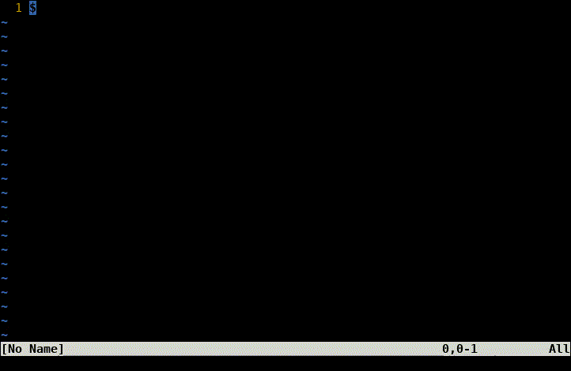

vim-linebox -- the VIM lines and boxes plugin.

linebox is a vim plugin to draw boxes and lines. Boxes are drawn by visually
selecting a rectangle, and then pressing either `<leader>b` or `<leader>B`
(with default mappings, enabled in vimrc. Lines are drawn by setting a start
and end mark, and pressing `<leader>L`. This will find the shortest path, from
start to end (if there is a path), no matter where the start and end positions
are, avoiding any text. Lines can start and stop on other lines, and will
merge with them.

NOTE: Add this to your vimrc for the three default mappings:
```
let g:linebox_default_maps = 1
```

## Bugs

**NOTE: If you find a bug, please file an issue.**

## Demo



## Features

- Draw boxes with `<leader>b`
- Draw blended boxes with `<leader>B`
- Draw lines with `<leader>L`

## Installation

Use your plugin manager of choice. On Windows, replace the directory `~/.vim`
with `~/vimfiles`.

- Vim Packages
    - Linux/Unix/OSX:
        - `git clone --recursive https://github.com/yoshi1123/vim-linebox ~/.vim/pack/bundle/start/vim-linebox`
      - Run `:helptags ~/.vim/pack/bundle/start/vim-linebox/doc`
    - Windows:
        - `git clone --recursive https://github.com/yoshi1123/vim-linebox ~/vimfiles/pack/bundle/start/vim-linebox`
      - Run `:helptags ~/vimfiles/pack/bundle/start/vim-linebox/doc`
- [Pathogen](https://github.com/tpope/vim-pathogen)
  - Linux/Unix/OSX:
      - `git clone --recursive https://github.com/yoshi1123/vim-linebox ~/.vim/bundle/vim-linebox`
  - Windows:
      - `git clone --recursive https://github.com/yoshi1123/vim-linebox ~/.vim/bundle/vim-linebox`
- [Vundle](https://github.com/gmarik/vundle)
  - Add `Bundle 'https://github.com/yoshi1123/vim-linebox'` to .vimrc
  - Run `:BundleInstall`
- [NeoBundle](https://github.com/Shougo/neobundle.vim)
  - Add `NeoBundle 'https://github.com/yoshi1123/vim-linebox'` to .vimrc
  - Run `:NeoBundleInstall`
- [vim-plug](https://github.com/junegunn/vim-plug)
  - Add `Plug 'https://github.com/yoshi1123/vim-linebox'` to .vimrc
  - Run `:PlugInstall`

## Quick start


Add `let g:linebox_default_maps = 1` to your vimrc (see "Default mappings"
below).


**Boxes**:

Use visual mode to select a rectable, and make a box with `<leader>b`.

Use visual mode to select a rectable, and make a box with `<leader>B` to blend
with other lines.

`<leader>b` vs `<leaderB`:
```
    <leader>b   <leader>B
 
     │  │  │     │  │  │
    ┌───────┐   ┌┼──┼──┼┐
    ││  │  ││   ││  │  ││
    └───────┘   └┼──┼──┼┘
     │  │  │     │  │  │
```

**Lines**:

Make a start and end mark with marks \`a and \`b (if using default mappings).
Then draw a line with `<leader>L`.

NOTE: There must be a path of whitespace from mark a to mark b.

## Default Settings

```
let g:linebox_default_maps = 0
let g:linebox_marks = ["'a", "'b"]
let g:linebox_animation = 1
```

## Default mappings

    nnoremap <leader>L :call linebox#lines#line(g:linebox_marks[0], g:linebox_marks[1])<cr>
    nnoremap <leader>b :call linebox#boxes#box()<cr>
    vnoremap <leader>b :call linebox#boxes#box()<cr>
    nnoremap <leader>B :call linebox#boxes#mbox()<cr>
    vnoremap <leader>B :call linebox#boxes#mbox()<cr>

## Documentation

In Vim:

    :help vim-linebox
